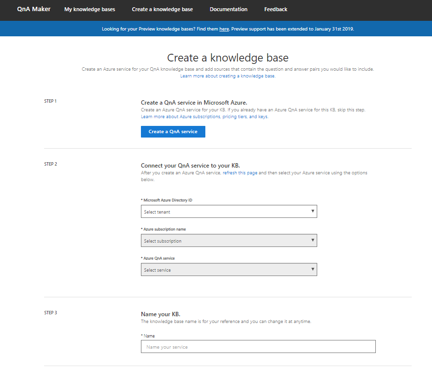
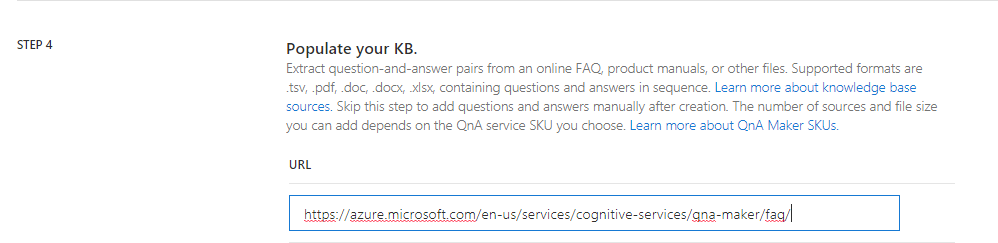
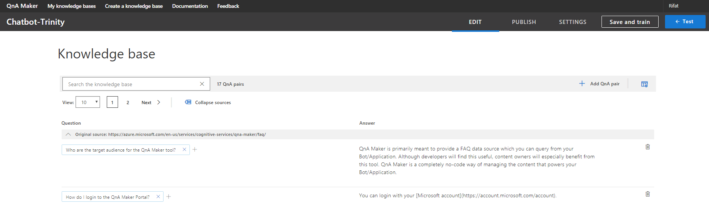
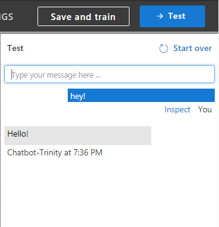
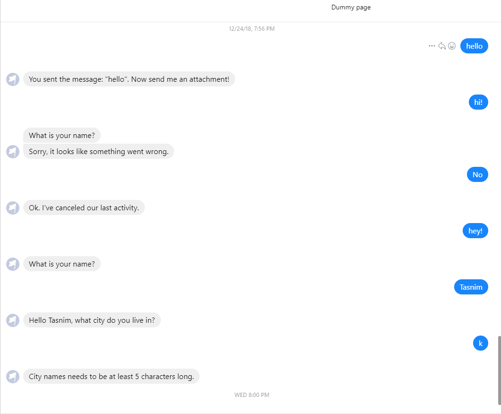

# [Building a Bot with QnA Maker]("/")

# *Why QnA maker?* 
QnA Maker is a cloud-based API service that creates a conversational, question and answer layer over data. It enables a user to create a Knowledge Base from semi-structured content. So, QnA maker is Ideal for **Frequently Asked Question (FAQ) URLs, product manuals, support documents and custom questions and answers**
____________

# *Building QnA maker for FAQ(Adding Personality to a FAQ Chatbot)*

Microsoft Cognitive Services provides pre-built models. We will be using Knowledge Service to add personality to a FAQ chatbot.

- To create a new QnA maker need to go to this [Page](https://www.qnamaker.ai) and hit Create a Knowledge Base.
    - 	Following page will be appeared 

    

    - *Step 1:* If there is no existing  QnA service created in azure portal hit Create a QnA service button and create QnA service.
    - *Step 2:* Fill all the required fields.
    - *Step 3:* Give a unique name for the chatbot.
    -  Step 4(Populate yout KB): Here in url section FAQ data(Question-and-answer pairs from online FAQ) will be added.  one and more url can be added. Files are also allowed to add as Dataset. I am using this [url]( https://azure.microsoft.com/en-us/services/cognitive-services/qna-maker/faq/)

       

       For now in Chit-Chat -> The Friend.

    - And Finally hit create your KB. Following page will be appeared 

       

    - Click Save and Train
    - Test the chatbot by hitting Test button.

       

    -  *And the FAQ service is ready.*
    -  So, It's time to publish the KB and from the *HTTP* request copy the followings in notepad
        - Host Url
        - EndpointKey from Authorization header.
        - KnowladgeBaseID from the *POST* Uri.
________________________

# *Creating Bot in azure and adding Knowladge to the bot with QnA*

 - At first need to create a Project
    - In visual studio create a new Echo Bot project.
    - Run the project.
    - To check if the bot working fine check the bot using *BotFrameworkEmulator*.

 - Setting up QnA maker intence in azure portal
    - create a new resource (search QnA Maker)
    - Pricing tire -> F0

 - Adding the Knowledge Base to the code
    - Open .bot file of the project.
    - Replace the contest of the file with following code
 ```c#
{
  "id": "3",
  "type": "qna",
  "name": "QnABot",
  "version": "",
  "kbId": "<POST uri saved previously>",
  "endpointKey": "<EndpointKey saved previously>",
  "hostname": "<HOST saved previously>"
}
 ```
 - In startup.cs make the following changes
    - Add 

    ```c#
     using Microsoft.Bot.Builder.AI.QnA;
     ```
    - Add the following code in the end of the class
    
     ```c#
     public Dictionary<string, QnAMaker> QnAServices { get; } = new Dictionary<string, QnAMaker>();
     ```
    - Run the code

  _________________________
 # *Adding Channels in the bot Service*
 - Go to azure portal and open previously created QnA web App
 - Hit channels option
 - Hit the facebook channel option.
 - Add add the key of the QnA service in facebook bot's webhook link option.
 - Now facebook messenger bot will responce according to the knowledge base.

 

 I've done the full work with help of following links:
 - [Building Intelligent Bot](https://aischool.microsoft.com/en-us/conversational/learning-paths/building-an-intelligent-bot)
 - [Build a Bot in Minutes with QnA Maker](https://channel9.msdn.com/Shows/AI-Show/Build-a-Bot-in-Minutes-with-QnA-Maker) 
 - [Creating Messenger Bot](https://developers.facebook.com/docs/messenger-platform/app-review/)
 - [Connect a bot to channels](https://docs.microsoft.com/en-us/azure/bot-service/bot-service-manage-channels?view=azure-bot-service-4.0)
 
 
    